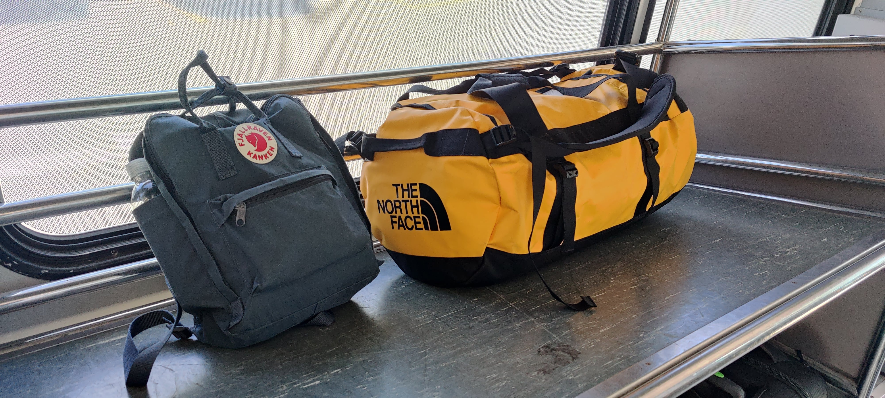

## TLDR

**Destination**: Toronto, Ontario, CA

**Dates**: 06/17/2022 - 06/22/2022

**Highlights**:

- Meeting up with Abeer and Uzlifat (fam)
- 
- 
- Trying authentic Canadian food like poutine
- Seeing the CN Tower from tons of angles throughout the city
- Art Gallery of Ontario, Aga Khan and Royal Ontario Museums
- Biking the coast of Lake Ontario, from downtown, through High Park, to Humber Bay Park and back
- 
- Buying Canadian-made clothes from Roots
- 

**Food**:

- 
- [La Bartola](https://www.google.com/maps/place/La+Bartola/@43.6558125,-79.4220368,15.64z/data=!4m6!3m5!1s0x882b35cc07b2d713:0x253d63b76861b7ee!8m2!3d43.655437!4d-79.4135957!16s%2Fg%2F11j8rf5d1b): a vegan Mexican spot on College with delicious vegan tacos.
- 
- 
- 

## Why did I go here?

When I was growing up, we had visited Canada once or twice, but never ventured very far in. A quick glance and photo op at Niagara Falls, just across the border, and then right back.

More recently, I've been more interested in cities than in sights/nature for my travel destinations.

I've drank all the online urbanist Kool-Aid that there is to drink. Accordingly, the kind of things I look to do whenever I travel are take trains, buses, enjoy public spaces and parks, and admire pedestrian and bike infrastructure.

When I got the opportunity to go this year, I was very excited about getting to see Toronto, Canada's most populous and cosmopolitan city.

Though I lived in an urban area already, it's nice to be able to get a change of pace, without going SO far away from home that I feel removed from my element. Without having done much research (and not really having much time for that anyway), Toronto was attractive as it was the closest metropolis that I felt rivaled the NYC Metro Area in terms of energy, diversity, walkability, bike infrastructure, and the other things that I have come to love about cities. I nabbed a cheap ticket, hastily packed two bags, and I was off.

## Getting in and getting settled

I did relatively little research before flying in, so most of my plans were made on-the-spot or in my hotel.

I visited Toronto in June of 2022. It was a short flight over from EWR to Billy Bishop. Landing at Billy Bishop is crazy, because the plane glides super low over Lake Ontario close to landing and you feel like you're skimming the surface.

It was my first time trialing my brand new bags that I grabbed at an REI in L.A. earlier this year. What I really appreciated about this setup was that I was able to carry everything I needed without sacrificing any mobility: I could walk and bike ride without too much difficulty carrying it all, which helped me skip a couple of rideshares.

I was very happy with the aesthetic of the bags, and the Fjallraven Kanken has become my new daily driver. The North Face Base Camp Duffel is an awesome color and is comfortable on my back and stores a ton, but could use a cross-body strap for some added convenience. I'll look into that.

I stayed at the Hilton Toronto, which was super nice! Conveniently located a short walk away from Union Station. It was comfortable, centrally located,
and kept very clean. I even had a view!

## Transit

Though this should be taken with a grain of salt because I didn't live in Toronto, nor did I have any kind of commute, I was really pleased with the TTC.
On every route I took, the station and train cars or buses were very clean. In the downtown area at least, I had no trouble getting from point A to point B.

From the get-go, I was able to take a free shuttle from Billy Bishop Toronto City Airport into downtown, right to Union Station.

The PRESTO transit card was super convenient, I was able to pick one up for $6 (a little pricey but it's definitely better than a MetroCard) at a TTC subway station, and reload it as needed.



It was a little less convenient to get to some destinations just outside the city, like the Aga Khan Museum. In those scenarios, I just bit the bullet and waited an extra long time for the bus, or took a rideshare.

Another interesting pillar of Toronto pedestrian transit was the PATH. Since I came in June and the weather was nice, I didn't have as much use for the massive network of underground tunnels in Toronto. However, I took a small jaunt through the PATH just because I'd never seen anything like it before. I found it to be SUPER humid and gross and dirty and dark and depressing. I appreciate that it exists, as it seems like a major investment in pedestrians and a walkable city, and I'm sure residents are able to get value out of it in the harsh winter months that Toronto has. However, the darkness combined with low ceilings and little-to-no policing / security are enough to keep me away.

## Biking

## Public spaces

### Downtown

### High Park

### Humber Bay Park

### Kensington Market

### Graffiti Alley

### College

## Museums

### Royal Ontario Museum

### Aga Khan Museum

### Art Gallery of Ontario

## Food

## etcetera