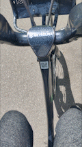
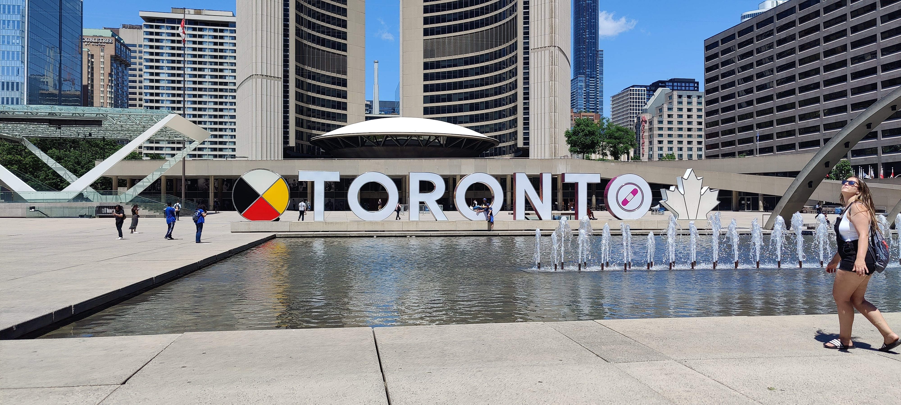
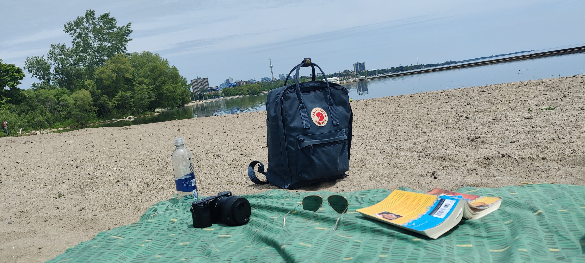

## TLDR

**Destination**: Toronto, Ontario, CA

**Dates**: 06/17/2022 - 06/22/2022

**Highlights**:

- Meeting up with Abeer and Uzlifat (fam)
- 
- 
- Trying authentic Canadian food like poutine
- Seeing the CN Tower from tons of angles throughout the city
- Art Gallery of Ontario, Aga Khan and Royal Ontario Museums
- Biking the coast of Lake Ontario, from downtown, through High Park, to Humber Bay Park and back
- 
- Buying Canadian-made clothes from Roots
- 
- Museums
  - 
  - 
  - 
- 

**Food**:

- 
- [La Bartola](https://www.google.com/maps/place/La+Bartola/@43.6558125,-79.4220368,15.64z/data=!4m6!3m5!1s0x882b35cc07b2d713:0x253d63b76861b7ee!8m2!3d43.655437!4d-79.4135957!16s%2Fg%2F11j8rf5d1b): a vegan Mexican spot on College with delicious vegan tacos.
- 
- 
- 

## Why did I go here?

When I was growing up, we had visited Canada once or twice, but never ventured very far in. A quick glance and photo op at Niagara Falls, just across the border, and then right back.

More recently, I've been more interested in cities than in sights/nature for my travel destinations.

I've drank all the online urbanist Kool-Aid that there is to drink. Accordingly, the kind of things I look to do whenever I travel are take trains, buses, enjoy public spaces and parks, and admire pedestrian and bike infrastructure.

When I got the opportunity to go this year, I was very excited about getting to see Toronto, Canada's most populous and cosmopolitan city.

Though I lived in an urban area already, it's nice to be able to get a change of pace, without going SO far away from home that I feel removed from my element. Without having done much research (and not really having much time for that anyway), Toronto was attractive as it was the closest metropolis that I felt rivaled the NYC Metro Area in terms of energy, diversity, walkability, bike infrastructure, and the other things that I have come to love about cities. I nabbed a cheap ticket, hastily packed two bags, and I was off.

## Getting in and getting settled

I did relatively little research before flying in, so most of my plans were made on-the-spot or in my hotel.

I visited Toronto in June of 2022. It was a short flight over from EWR to Billy Bishop. Landing at Billy Bishop is crazy, because the plane glides super low over Lake Ontario close to landing and you feel like you're skimming the surface.

It was my first time trialing my brand new bags that I grabbed at an REI in L.A. earlier this year. What I really appreciated about this setup was that I was able to carry everything I needed without sacrificing any mobility: I could walk and bike ride without too much difficulty carrying it all, which helped me skip a couple of rideshares.

I was very happy with the aesthetic of the bags, and the Fjallraven Kanken has become my new daily driver. The North Face Base Camp Duffel is an awesome color and is comfortable on my back and stores a ton, but could use a cross-body strap for some added convenience. I'll look into that.

I stayed at the Hilton Toronto, which was super nice! Conveniently located a short walk away from Union Station. It was comfortable, centrally located,
and kept very clean. I even had a view!

## Transit

Though this should be taken with a grain of salt because I didn't live in Toronto, nor did I have any kind of commute, I was really pleased with the TTC.
On every route I took, the station and train cars or buses were very clean. In the downtown area at least, I had no trouble getting from point A to point B.

From the get-go, I was able to take a free shuttle from Billy Bishop Toronto City Airport into downtown, right to Union Station.

The PRESTO transit card was super convenient, I was able to pick one up for $6 (a little pricey but it's definitely better than a MetroCard) at a TTC subway station, and reload it as needed.



It was a little less convenient to get to some destinations just outside the city, like the Aga Khan Museum. In those scenarios, I just bit the bullet and waited an extra long time for the bus, or took a rideshare.

Another interesting pillar of Toronto pedestrian transit was the PATH. Since I came in June and the weather was nice, I didn't have as much use for the massive network of underground tunnels in Toronto. However, I took a small jaunt through the PATH just because I'd never seen anything like it before. I found it to be SUPER humid and gross and dirty and dark and depressing. I appreciate that it exists, as it seems like a major investment in pedestrians and a walkable city, and I'm sure residents are able to get value out of it in the harsh winter months that Toronto has. However, the darkness combined with low ceilings and little-to-no policing / security are enough to keep me away.

## Biking



Toronto's bike infrastructure was a huge help on this trip. A good friend once told me, **"bikes are the cheat code to a city"**, and every time I visit a new city, this resonates with me because I would not have been able to explore Toronto as well as I did without [PBSC](https://www.pbsc.com/cities/toronto-bike-share), Toronto's bike share program.

## Public spaces

The public spaces I saw in Toronto really amped up my experience in the city. I've taken the liberty of listing some of my favorite places down below.

### Downtown

I'm getting a little exhausted so I'm gonna listicle some bits of the rest of this post.

- Yonge-Dundas Square
  - This is like the "Times Square" of Toronto, though not nearly as frenetic and chaotic.
- Holt Renfrew
  - This was a gorgeous upscale shopping center where I could get some gifts for Abeer and Uzlifat on my first day, from stores like Nordstrom and YSL.
- Yonge St, Bloor St
  - Both downtown food streets
- Rogers Building
  - Really gorgeous corporate headquarters tucked in the middle of a bunch of taller, skinnier skyscrapers downtown. Pictured above.

### High Park

I was excited about High Park because it seemed to be the closest I could get to something like Central Park, though it was not in the center at all. High Park lies on the far west side of Toronto's coastline, and it took quite a bit of biking to get there from downtown.

However, once I got there, it really was nice to get a long ride in and walk through the free-to-public zoo in the park.

Should I visit Toronto again, I think I might take the trip to Don Valley Brick Works Park on the east side of the city instead. The Don River runs through this park, so it should make for some nice scenic rides or walks.

### Humber Bay Park

This park was even further west than High Park, but Humber Bay really ticked all the boxes! It wasn't SO BIG that I couldn't navigate around the park with ease, and it had paved bike trail running all through it and along the coast of Lake Ontario. I was even able to stop by a beach and read for a stretch!

### "Graffiti Alley" (Rush Lane)

This was a super cool public art phenomenon, where the Queen Street West Business Improvement Association worked to legalize street art and create an area of cultural significance. It was just a LONG stretch of really interesting graffiti, and I took photos of some of the most beautiful ones.



## Museums

As a global city, Toronto of course has some grade A museums featuring acclaimed and well-curated exhibits.

For my favorite ones, I'll probably fork them out to different posts and update with links here later. For now, here are the highlights.

### Royal Ontario Museum



### Aga Khan Museum

This museum was my favorite, though it was SUPER out of the way on the far east side of Toronto. I had to take two buses with a super infrequent run schedule to get here.

However, it simply could not be overlooked.

They really went out of their way to curate an experience that immerses you in a diversified, beautiful story of Islam's history, geography, and associated cultures. This could be felt down to the architecture of the building.



### Art Gallery of Ontario

This was just your classic big-city modern art museum. However, the sprawling sculpture halls here really blew me away. I will definitely visit again and try to write down more of what I observed for a separate post. But for now, while my memory escapes me, here's the photos I could dig up.



## Food

Like any other internationally-renowned metropolis, Toronto is famed for its food. All my (brief) research seemed to indicate that Toronto was actually an amazing place for vegan food. Though I'm not a vegan myself, and I've been hard-pressed to find vegan food I like at restaurants, I gave Toronto a chance on the good word of the internet and it DID NOT DISAPPOINT. If I lived in a place where I could get vegan food of this quality and flavor so readily, I might just switch over to _the other side_.

### PLANTA Queen

Though I found out later that this is an international franchise, this PLANTA was one of the most gorgeous and visually impressive restaurants I've ever been in. I enjoyed my experience so much that I found a PLANTA in Manhattan when I got back home and tried to relive the experience there! This PLANTA on Queen St in Toronto really blew me away with the decor, the flavor, and the well-made drinks. This was the restaurant that made me believe all the rumors I was hearing about Toronto being an amazing place for vegan food.



### Earl's Restaurant and Kitchen

I found this place while looking for a late-night bite somewhere close to my hotel. Earl's had a dark and sexy mood to it, and exuded class without seeming too stuffy. Perfect balance between fancy and casual. I'm not sure exactly what these tiny sushi tacos were made out of (watermelon sushi or something like that???). I'll cross reference against the menu if I ever go back. But this place was exactly what I needed at 11:30PM.



### Rolltation

This was likely just a quick bite for me while I was on the go, but I found some photos and it is a Toronto-only franchise (for now), so thought it would be worth sharing. Though creating something like a sushi-burrito is probably a culture crime, I really did enjoy this because the ingredients were fresh and the restaurant had a good atmosphere! I'm a sucker for a neon sign.



### Karahi Point

Is this cheating if it's technically in Missisauga? I went to this Pakistani restaurant with Abeer and Uzlifat and it didn't disappoint! It was a ways away from downtown Toronto, but I really tasted the spice and authenticity in the karahi, and this kind of thing is HARD to find in the NY Metro Area 
(outside of my parent's house, of course). Something about having good company must have made the food taste even better... Unfortunately, I don't have any up-close-and-personal photos of this particular meal because I was RAVENOUS and we all started digging in the moment the food hit the table.



## etcetera

### Me in Ontario

I think it would be obnoxious to blast social media with all these, so here are the photos I took of myself in Toronto, mostly just random mirror selfies as this was a solo trip.



### Daily Logs


