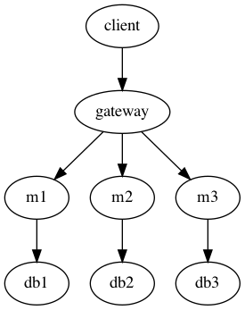

## Terms
### Client
A client is simply someone that requests information from or submits information to your APIs.

### REST / RESTful API
A REST server or RESTful API is a service that leverages an architectural style that embodies the following central principal:

A **client** can **request** an **action** that optionally consumes some **resource** and returns some "next" **state**.

A true RESTful API should be stateless, and the protocol that most microservices use to communicate with RESTful APIs is **HTTP**.

The standard pattern is when communicating with a REST API over HTTP is to *make an HTTP request* and *accept a response*. With REST, you always need a request and a response.

### HTTP Methods / Verbs
When we make requests to a RESTful API using HTTP, we can associate some methods or verbs to the resource that we send or request. The methods that we can use are:

**GET**, HEAD, **POST**, **PUT**, **PATCH**, **DELETE**, CONNECT, OPTIONS, TRACE

> Important / most common ones are bolded

### HTTP Status Codes
An HTTP status code is typically attached to an HTTP response from a RESTful API. This indicates the nature of the response returned from the server. You can browse a bunch of HTTP status codes [here](http://http.cat).

### Synchronous vs. Asynchronous
These two terms describe the behavior of the client that makes an HTTP request. A client can either be synchronous, where it waits for the response from the server before moving on, or it can be asynchronous, where it continues to do work in the primary application thread after making an HTTP request, but spins off another thread that continues to wait for the server's response and eventually performs some action with the response via a "callback function."

### API Gateway
An API gateway serves as an entrypoint to the rest of the microservices. Though each microservice is hosted in its own place, your clients should be able to hit one uniform URL to be able to reach all of your services. This API gateway should be highly available, but it (conveniently) doesn't have to do a lot of work. It simply forwards requests to all your individual microservices.

For example, if you hit `http://apigateway.com/ms1`, your API gateway should be able to recognize that your user is trying to get to `ms1` and forward their request to that service (`http://ms1.com`).

In cloud native architectures, you may also hear of the terms "reverse-proxy" or "load-balancer." These all do similar things, they mostly come in one big package, and you may group them into one mental category for now.

### Microservice
Traditionally, APIs were written in a *monolithic* fashion, where one server would provide nearly all the behavior for an application. However, these became difficult to maintain, and because of re-deploys, an update to any part of the application would require a full restart of your entire application.

Microservices split a *monolithic* API into several, more managable units. This allows for one service to manage simply one piece of a larger application. If that one service needs to be re-deployed or changed, it does not impact the overall application as much as it would if the API was a monolith.

## Principles of Microservices

### SRP (Single Responsibility Principle)
As with all good software, a microservice should do one thing and do it well. If a microservice starts to have to manage multiple, vastly different responsibilities, it should be split.

The same can be said about more atomic pieces of a microservice: a function should only do one thing. A class should only manage functions concerned with one thing. We try to accomplish bigger things using **composition** of smaller things.

### Design around business function
A microservice should not be written to a technical specification, or to accomplish a technical task. Instead, a microservice should accomplish some business utility. For example, instead of writing a service that handles all your database interactions, you should write a service that manages all data about a user's registration.

### Automate everything
Microservices must be able to quickly come into a group of interacting services without requiring manual intervention. Any manual intervention required means downtime, wasted resources, and room for error.

### Keep coupling loose
Microservices will undoubtably be required to talk to one another, but their interdependence should be loose. A change in one microservice should generally cause very little (if any at all) disruption or change in other services.

### Monitor
In a platform with multiple microservices, it should be quick and easy to assess the uptime and health of each microservice independently. Each microservices logs should be independently observable via log filtration against some label field. However, when microservices call each other, there should be a way to trace the trail through the services using something like a **correlation ID**.

### Build fault-tolerant
Once you are able to monitor the health of a service, you should start thinking about fault-tolerance, resilience, and "self-healing." Because we have the ability to catch errors or exceptions, developers will more often than not know exactly what is wrong when code breaks in a certain flow. A good microservice will be able to either:

1. Fail gracefully with a clear message explaining what went wrong
2. Handle the error with a retry, or restart itself and attempt the action again (self-heal).

### Independently scalable
A microservice should be able to grow to accommodate increased load without growing the entire application. For example, you should not need the same number of instances across each of your microservices. You should be able to have 2 instances of service A, and 15 instances of service B, because B just happens to get more load than A. Having 15 instances of service B should not require you to have 15 instances of service A.

To achieve this, you will want to have "load-balancing" over your replication of a microservice. So if service A needs to call service B, it should not necessarily get the same instance every time. A load-balancer consumes the request from service A, determines which instance of service B should handle it, and forwards the request there to complete the transaction.

### Builders are owners
Nobody knows the flow of the application better than the implementer. There should not be an "ops" team in charge of operating your application once it is built. You build it, you own it. There is nobody more qualified to debug and operate it than you.
